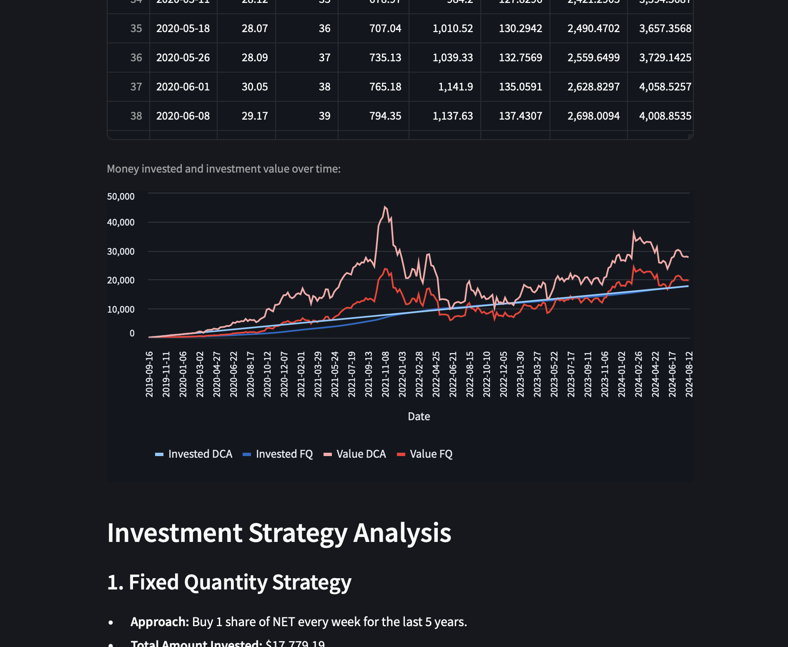

# Using Pandas and Streamlit to compare Investing Strategies

[](https://github.com/wolfpaulus/dca/actions/workflows/python-test.yml)
[](https://github.com/wolfpaulus/dca/actions/workflows/azure-deploy.yml)
[](https://github.com/wolfpaulus/dca/actions/workflows/docker-publish.yml)
[](https://dca.techcasitaproductions.com)


## Overview

Automatic investing is a strategy that can help individuals build wealth steadily over time. One common approach is **Dollar Cost Averaging (DCA)**, which involves investing a fixed dollar amount at regular intervals, regardless of the asset's price. This method results in buying more shares when prices are low and fewer shares when prices are high. Another approach is to **buy a fixed number of shares at regular intervals**.

This Python program simulates both investment strategies using historical stock market data from the past five years, sourced from Yahoo Finance. The user interface is built with [Streamlit](https://streamlit.io/), a popular open-source Python framework that enables data scientists and AI/ML engineers to create interactive data applications.

## Implementation Details

While the necessary calculations could be implemented with Python's built-in data types (like lists and dictionaries), we opted to use **pandas** for its ease of use with time series data and integration with the CSV format, which is the format provided by Yahoo Finance.

### Changing providers from Yahoo Finance to Nasdaq
Since September of 2024, historical stock data is now only available to their Premium-Gold customers (billed $479.40 yearly) for now Nasdaq still provides that information freely, using the JSON format. E.g.:

```json
{
  "data": {
    "symbol": "NET",
    "totalRecords": 1254,
    "tradesTable": {
      "asOf": null,
      "headers": {
        "date": "Date",
        "close": "Close/Last",
        "volume": "Volume",
        "open": "Open",
        "high": "High",
        "low": "Low"
      },
      "rows": [
        {
          "date": "09/06/2024",
          "close": "$76.05",
          "volume": "1,927,634",
          "open": "$78.64",
          "high": "$79.21",
          "low": "$75.71"
        }
      ]
    }       
  }
}
```
### Data Handling

The user inputs a stock or fund ticker symbol (e.g., 'AAPL' for Apple Inc.), and the program retrieves the last five years of trading data for that stock. The data is then filtered to include only the first trading day of each week, as the simulation assumes weekly investments. The relevant columns from the dataset are:
- `date`
- `close`

These columns are used to calculate the investment values.

### Strategy: Fixed Quantity (SQ)

In this strategy, the user buys a fixed number of shares each week. The following columns are added to the dataset:
- **`Shares FQ`**: The cumulative number of shares purchased, incremented by 1 each week.
- **`Invested FQ`**: The cumulative amount invested, which is the sum of the weekly "Adj Close" prices for each share purchased.
- **`Value FQ`**: The value of the acquired shares at any given time, calculated as `Shares SQ * Adj Close`.

At the end of the simulation, the last row provides:
- **Total Investment (`Invested FQ`)**: The total amount of money invested over the five years.
- **Current Value (`Value FQ`)**: The current worth of the investment based on the final adjusted closing price.

### Strategy: Dollar Cost Averaging (DCA)

For DCA, the program calculates the total amount invested in the SQ strategy (`Invested SQ`) and divides it by the number of trading weeks, resulting in the weekly investment amount (`wa`). The following columns are added:
- **`Shares DCA`**: The cumulative number of shares purchased, calculated by dividing the weekly investment (`wa`) by the "Adj Close" price.
- **`Invested DCA`**: The cumulative amount invested, which is the sum of the weekly investments (`wa`).
- **`Value DCA`**: The value of the acquired shares at any given time, calculated as `Shares DCA * Adj Close`.

## Visualization

Finally, a line chart is generated to show the performance of both strategies over time. This visualization allows users to compare the growth of their investments under each approach, providing a clear picture of how different strategies can impact wealth accumulation.



## Deployment / CICD

The app is currently deployed on [Azure](https://webapp-rh5dsxbm77scq.azurewebsites.net) as well as on a [linux server](https://dca.techcasitaproductions.com) as a docker container.
The [instructions directory](./instructions/action.png) contains more details about the deployment workflows.