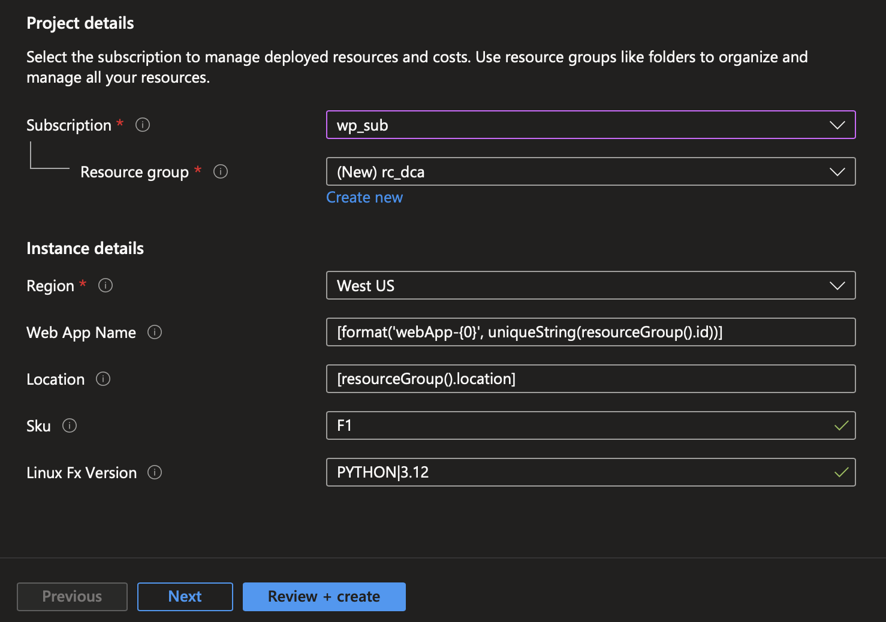
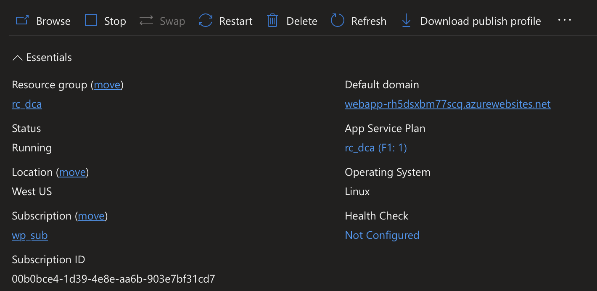
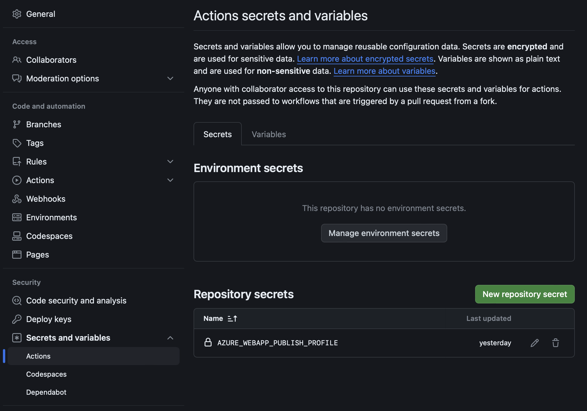
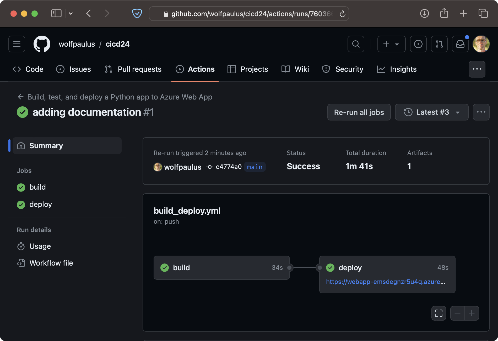

# CI/CD

Here we will create an Azure App service, allow your GitHub repository to publish to Azure, and create a Github Action to test and deploy your app
## Azure

### Creating an App Service
Create an App Service app using an ARM template: (https://learn.microsoft.com/en-us/azure/app-service/quickstart-arm-template?pivots=platform-linux)
Before moving forward, consider [Azure App Service on Linux pricing](https://azure.microsoft.com/en-us/pricing/details/app-service/linux/) and 
change the ```sku``` accordingly.

#### Python Version
Inside the app_service.json "Python 3.12" is the cureently configured runtime. To see all currently available Python versions you could to this:
```shell
az login
az webapp list-runtimes --os linux | grep PYTHON
```

__Please note:__ If you made any changes to the app_service.json file you need to modity the link below, so that it points to the ```./arm/app_service.json``` file in __your__ repository.

[](https://portal.azure.com/#create/Microsoft.Template/uri/https%3A%2F%2Fraw.githubusercontent.com%2Fwolfpaulus%2Fdca%2Fmain%2Farm%2Fapp_service.json)

Clicking the button will log you into Azure and create an Azure App Service as it is declared in the ./arm/app_service.json file.

- Select the appropriate subscrition (in case your account has multiple subscriptions.)
- Select an existing, or create a new Resource Group, (I create a new resource group and named it 'rc_dca'.)
- Select a region (if you using the free Sku (F1), make sure you are not already running a Linux/Python app in the selected region.)
- Click "Review + create" (very bottom of the page.)
- Click "Create" on the next page.

### Download the the "Publish Profile"
- You can now __download__ the "Publish Profile", an XML file, from the "Overview page" of your Web App in the Azure Portal. Click on "Download"


## GitHub

### Allowing Github to deploy to Azure
**GitHub Actions** makes it easy to automate all your software workflows, now with world-class CI/CD. Build, test, and deploy your code right from GitHub.

### Add a secret in your repository
- On https://github.com create a secret in your repository and name it AZURE_WEBAPP_PUBLISH_PROFILE. Paste the publish profile contents (the xml file you downloaded in teh previous stop) as the value of the secret.


## Local Repository
### Github Action
- Edit the ```.github/workflows/build_deploy.yml``` file. Set the AZURE_WEBAPP_NAME environment variable to your web app's name.
E.g.: AZURE_WEBAPP_NAME: 'webApp-emsdegnzr5u4q'
- Add, Commit, and Push, to trigger the workflow
 


## Public web app
After some waiting, the public web app can be accessed here: https://[AZURE_WEBAPP_NAME].azurewebsites.net


[](./4.md)