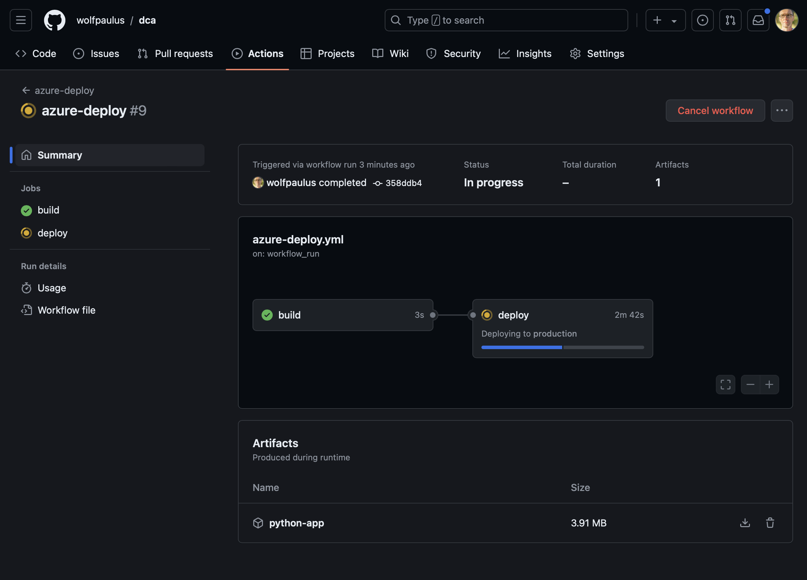
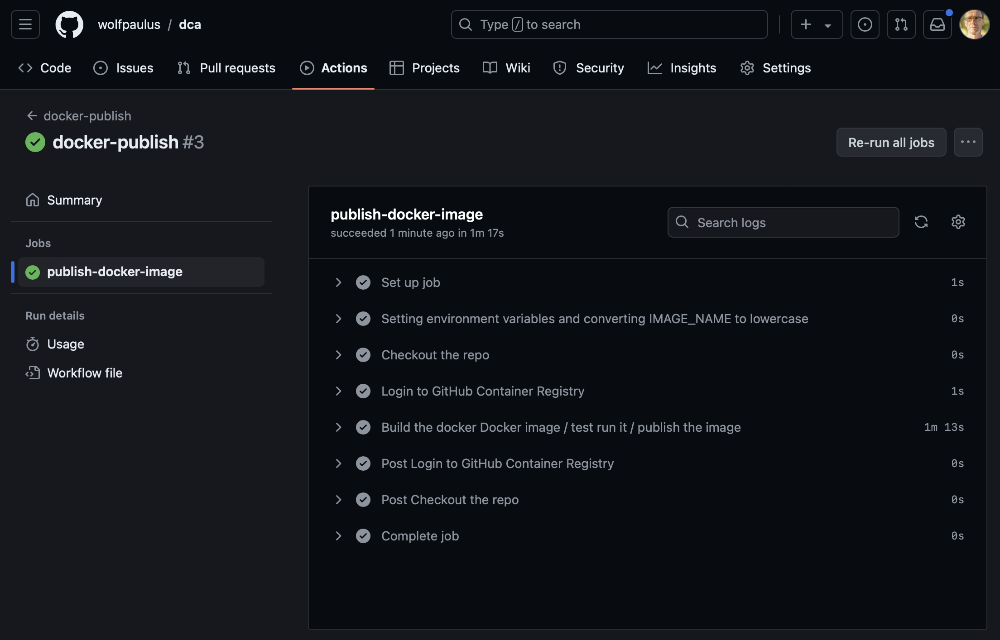

# CI/CD
## Local Repository
### Github Action
 The ./github/workflows directory contains three workflows:
 1. python-test
 1. azure-deploy
 1. docker-publish

#### python-test
This workflow runs everytime a commit is pushed to github.
Should autopep8 linting succeed, pytest runs. Only if pytest succeeds without failiures will the other two workflows run.  


#### azure-deply 
This workflow will deploy the python app on Azure.
- Edit the ```.github/workflows/azure_deploy.yml``` file. Set the AZURE_WEBAPP_NAME environment variable to your web app's name.
E.g.: AZURE_WEBAPP_NAME: 'webApp-rh5dsxbm77scq'
- Add, Commit, and Push, to trigger the workflow



##### Public web app
After some waiting, the public web app can be accessed here: https://[AZURE_WEBAPP_NAME].azurewebsites.net
 
#### docker-publish
This workflow build a docker image and puiblishes is in the GitHub Container Registry. Since this repository in public, the [container image](https://github.com/users/wolfpaulus/packages/container/package/dca) is publically available as well.

The most important part of the `docker-publish.yml` file is that it builds a multi-platform container for linux/amd64 andlinux/arm64/v8
I found the following resources which were very helpful:

1. https://collabnix.com/error-multiple-platforms-feature-is-currently-not-supported-for-docker-driver/
2. https://depot.dev/blog/multi-platform-docker-images-in-github-actions



[](./5.md)