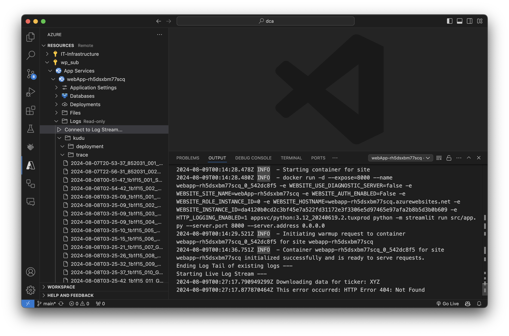

# CI/CD

## Logging

Messages that the application logs appear (with a short delay) in the application log, (locally stored in the './app.log' file.
In ```arm/app_service.json``` we configured the log on azure with a Quota (MB) of 40, look for the **logsDirectorySizeLimit** parameter.

With the Azure extension installed, the application's log can be inspected inside VSCode.
Look for it here:
Subscription > App Service > webApp-... > Logs > Connect to Log Stream


